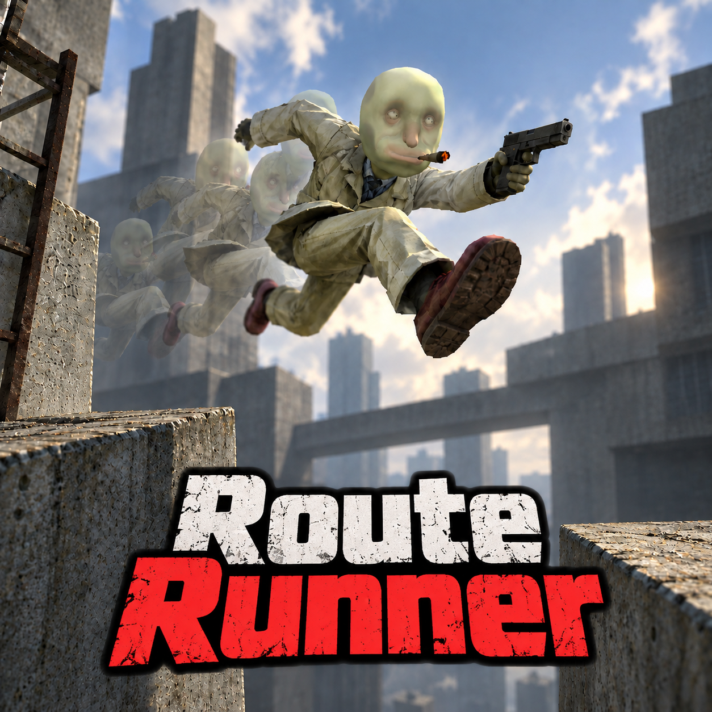

# Route Runner

A BepInEx mod for recording and sharing movement routes in STRAFTAT's exploration mode. Record a take, replay it as a character ghost, then send the route to someone else to practise.



## Install

Download the ZIP from [Releases](https://github.com/N0x1/RouteRunner/releases) and import it as a local mod in r2modman or Thunderstore Mod Manager. It requires [BepInExPack](https://thunderstore.io/c/straftat/p/BepInEx/BepInExPack/) and [Mod Menu](https://thunderstore.io/c/straftat/p/kestrel/Mod_Menu/).

Launch the game through your mod manager, enter an exploration map and press **F6**. If you have an older manually installed copy, remove that DLL first. Keep your routes and config.

## Controls

| Key | Action |
| --- | --- |
| F6 | Open or close the panel |
| F7 | Record / finish and save |
| F8 | Play or restart the selected ghost |
| F9 | Save the recording and remove the ghost |
| F10 | Return to the route's start |

The panel has a map-filtered route library, playback controls, sharing tools and a trim editor. You can adjust playback speed, loop a route and scrub through it. Trimming keeps a backup; deleted routes can be recovered.

Change bindings, ghost colour, transparency and recording limits under **Settings → Mods → Route Runner**. **Show HUD** hides the overlay without disabling recording. **Enable Mod** turns the mod off or back on without restarting.

Opening the panel finishes a recording and pauses the ghost. Close it to move again. If Escape opens the pause menu, resume the game to return to practice.

## Share a route

Select a take, then use **Sharing → Export file**. Send the `.sroute` file from the exports folder.

The other player puts it in their imports folder and clicks **Import files**. Both players need the same map and a compatible game version. Short recordings can also be shared using **Copy route code** and **Import clipboard code**; use files if the code is too long for chat.

Routes live in `BepInEx/RouteRunner`. The panel's folder buttons open the correct location for the active profile. Settings are in `BepInEx/config/practice.straftat.routerunner.cfg`.

## Build

You need Windows, the .NET 9 SDK, a STRAFTAT installation, BepInEx 5.4.23.5 and the Mod Menu 1.2.0 reference DLL. Game and dependency assemblies aren't included here.

Put the BepInEx `core` folder in `reference/BepInEx/` and `ModMenu.dll` in `reference/ModMenu/`, or supply their locations:

```powershell
./build.ps1 -GameDir "C:\Program Files (x86)\Steam\steamapps\common\STRAFTAT" `
  -BepInExDir "D:\Modding\BepInEx" -ModMenuDir "D:\Modding\ModMenu"
```

The script runs the managed tests and loader check, builds the DLL and creates the Thunderstore ZIP in `dist`. To run the file-format and library tests without the game installed:

```powershell
dotnet run --project tests/RouteRunner.Tests.csproj -c Release
```

## Scope and issues

This is for exploration practice. Ghosts have no collision or damage. Recordings capture character movement, not weapons, moving platforms or changes to the map. Return to start doesn't rewind the world or cooldowns.

Built against STRAFTAT 1.4.8a. Other mods and game updates can affect compatibility. For a bug report, include your game/mod versions, steps to reproduce it and the relevant Route Runner entries from `BepInEx/LogOutput.log`.

Thanks to Lemaitre Logiciels for STRAFTAT and its public source, Kestrel for Mod Menu, and the BepInEx project.

MIT licence; see [LICENSE](LICENSE).
